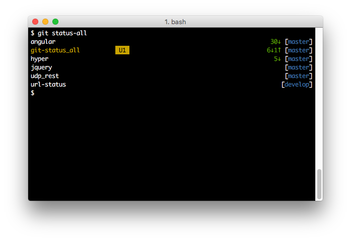

# git status-all

## Installation

    $ gem install git-status_all

## Usage

Run the `status-all` subcommand inside a directory containing a number of repositories, and it will show the status for all of them.

    $ git status-all

Often you want to fetch from all the remotes for each repository first to see if there are any upstream changes. Use the `--fetch` or `-f` option to do this.

    $ git status-all --fetch

It is also possible to look in a particular path instead of the current directory

    $ git status-all ~/dev/ios

## License

The gem is available as open source under the terms of the [MIT License](http://opensource.org/licenses/MIT).
